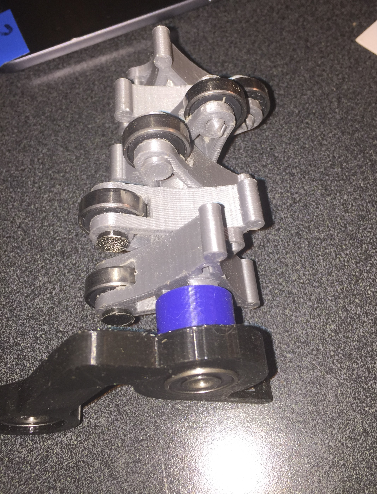

This is S3l3ctor, an open source 6 chroma filament selector system currently under development. You can print any color (up to 6) you want without changing your extruder design.

Table of Contents
=================

   * [BOM](#BOM)
      * [Printed Parts:]()
      * [Hardware:]()
      * [Electronics:]()
   * [Assembly]()
      * [Tumbler]()
         * [Shaft preperation]()
      * [Main Body]()
         * [Prusa frame clip mount]()
         * [Main body bearings and rods]()
         * [Drive gear allignment]()
      * [Magic Mushroom splitter and bowden tubes]()
      * [Electronics]()

S3l3ctor is:
* A 100% open source filament selector
* Costs under $120
* Can use up to 6 colors at once
* Lets you keep your extruder
* Can work on any printer with a USB port or spare pins
* Being developed by Matt when he's not doing homework
* Is undergoing closed Alpha testing right now

S3l3ctor is **not**:
* Done yet
* Accepting donations not made in 4043d
* A MMU2 clone
* Requires changing extruder hardware
* For the faint of heart (yet!)

S3l3ctor is an open source filament selector under development. Development is being led by ThatMattGuy (Matt) in collaboration with other community members.

At this point the project is undergoing closed alpha testing and will have an open beta starting soonTM. I mean you print the parts, but it's likely not a good idea yet.

Link the the [Github STLs](https://github.com/PrusaOwners/s3l3ctor) (Please please please don't click unless you know what you are doing)

# BOM

## Printed Parts:

| STL Name              | Quantity |
| ---- | ---- |
| MainBodyV2                               | 1 |
| barrelidlerholder_v2.STL                | 1 |
| barrelMotorholder_v2 .STL               | 1|
| A1R1__Body_spring_x2.STL             | 0|
| A1R1_AssemblyHolder_x2.STL             | 2 |
| RetainerV2.STL                           | 2 |
| A1R1_SplitterShroom_x1.stl             | 1 |
| A1R1_tumblerV64_maleEnd_x1.stl        | 1 |
| A1R1_tumblerV64_motorEnd_x1.stl       | 1 |
| A1R1_tumblerV69_pin_x6.stl            | 6 |
| A1R1_tumblerV69_withsupports__x6.stl | 6 |
| For Skelestruder People:                        | |
| PC4-m10_SKELESTRUDER_B1.stl            | 1|

## Hardware:

| Item | Quantity | Example link |                           
|---- | ---- | ----|
| Bolts | (how many? What size?) | Soon^tm |
| Square nuts | 2 | Spares bag|                                                                                               
| 608 bearings | 8 | [ebay](<https://www.ebay.com/itm/8pcs-625-2Z-625-ZZ-C3-Double-Metal-Shielded-Ball-Bearing-5x16x-5mm-US-Stock-M496/401542781331?hash=item5d7dd09993%3Ag%3Akq0AAOSwZrhacTfp&_sacat=0&_nkw=625+bearing&_from=R40&rt=nc&_trksid=p2047675.m570.l1313.TR0.TRC0.A0.H0.X625+bearin.TRS1>)  |
|Mk8 Gears| 6 | [Amazon](<https://www.amazon.com/BALITENSEN-Direct-Extruder-Reprap-Effective/dp/B07792SHML/ref=sr_1_5?ie=UTF8&qid=1533246923&sr=8-5&keywords=mk8+gear>) |
|Pc4-M10 fittings, pass through or drill them out | 7| soon^tm|
|PTFE tubing ID 2mm OD 4mm | couple meters | [ebay](<https://www.ebay.com/itm/PTFE-Bowden-Teflon-Tube-1-75-Filament-3D-printer-RepRap-Rostock-Kossel/162932641530?hash=item25ef8acefa%3Am%3Amv4vboRH9_rfasJIsMfowVw%3Asc%3AUSPSFirstClass%2194087%21US%21-1&var=462001182875&_sacat=0&_nkw=teflong+tube+3d+printer&_from=R40&rt=nc&_trksid=m570.l1313&LH_TitleDesc=0%7C0>) |
|5mm rod 100mm+ long| 2x|https://www.amazon.com/Uxcell-a15113000ux1223-150mm-Model-Straight/dp/B01B5QTM8I/ref=sr_1_6?ie=UTF8&qid=1535987871&sr=8-6&keywords=5mm+rod|

## Electronics:

| Item | Quantity | Notes and URL|
|----|----|----|
|RAMPS + 5x A4988 drivers + Mega kit | 1 | [ebay link](https://www.ebay.com/itm/3D-Printer-Kit-RAMPS-1-4-Mega2560-A4988-12864-LCD-Controller-for-Arduino-Reprap-/252181241032) - TODO find a better kit link |
|**POWER OPTIONS**|||
|12v 2 amp power brick| 1| If you want to externally power S3l3ctor - [Example brick](https://www.amazon.com/Amamax%C2%AE-Wall-Adapter-Power-Supply/dp/B00KZ2ZQE8) - TODO find a better example
|12v 2 amp buck converter| 1| OPTIONAL - For those who want to run off a 24v PSU. Make sure you have enough PSU headroom! [Example](https://www.amazon.com/Converter-Step-Down-Module-Voltage-DCCON-CPT245/dp/B00BNPYBM4) - TODO verify links
| If you have a 12v PSU and want to power off the PSU| |You're fine, nothing needed here :D |
||||
| Microswitch with bearings | 9| [Something like this](https://www.google.com/url?sa=i&rct=j&q=&esrc=s&source=images&cd=&cad=rja&uact=8&ved=2ahUKEwjel62xqpDdAhVqwVQKHV7hCeEQjhx6BAgBEAM&url=https%3A%2F%2Fwww.ebay.com%2Fitm%2F10Pcs-Micro-Roller-Lever-Arm-Open-Close-Limit-Switch-KW12-3-PCB-Microswitch-MYAL-%2F221982152794&psig=AOvVaw2WRzgkcSNxDZ9WlTds0HjS&ust=1535565761090100)

For a RAMPS setup: Set of RAMPS plus at least 2x A4988s (usually 5x) plus Mega Either a 12v brick (2 or more amps) or 24v to 12v buck regulator off of printer PSU 2x NEMA 17s 7-8x microswitches with bearings

# Assembly

## Tumbler

### Shaft preperation

Begin by filing, grinding or otherwise abrating a flat a mm or two deep (doesn't really matter), and about 5mm long. While you have the shaft out, make sure that your 625 bearings will slide smoothly along the shaft. They shouldn't slide smoothly like a linear bearing, but at the same time they should not need pounding. A more scientific way to quantify this is with a calipers - if the bearings' ID is more than 30 micron undersized (4.97mm or so), the fit on the 5mm rod is going to be close. Like, probubly too close. I recomend measuring bearings and finding the best ones, and saving the best 3 for these next steps.

## Main Body

### Prusa frame clip mount
If you have an M3 tap, use it to clean up the clip mounts on the bottom of the main body. If not, just use 4x M3x16mm bolts to secure the clips as shown.

### Main body bearings and rods
Using an abrasive tool such as dremel or file, grind a flat about 1mm deep along the whole length of the rod (at least 100mm). Slide 6x Mk8 drive gears onto the rod and set it aside.

Press one of the closed tolerenced bearings you found into the motor side end of the drive gear path. Make sure it's flush - if it's not, use a pair of pipe grips or pliers or blunt object to push it in. Now take the 5mm rod with Mk8 gears on it and push it in from the far (Non-motor) side to the bearing - not all the way, but enought to have say 10mm sticking out on the motor side. Now slide the second close tolerence bearing onto the shaft (non-motor side again) and press flush against the main body (using tools if necessary). The whole assembly should look like this:

### Drive gear allignment

Use a scrap piece of filament as shown below to fine tune drive gear allignment. insert the filament through one hole in the front and out the back, starting on the left. Allign the drive gear left to right on the rod, and then turn the flat side of the rod and set screw on the gear so they both face up and tighten down with an allen key. Make sure the gear does not wiggle on the rod (that would be bad).

## Magic Mushroom splitter and bowden tubes

The Magic Shroom needs some love at this point. The printed PC4-m10 threads are often pretty messy and making the PC4-M10 press fit fittings fit can take some work. If necessary, be sure to drill out the fittings so that a 4mm bowden tube can pass through all the way. 

Cut the 7x bowden tubes to their requisite lengths. 

## Electronics
